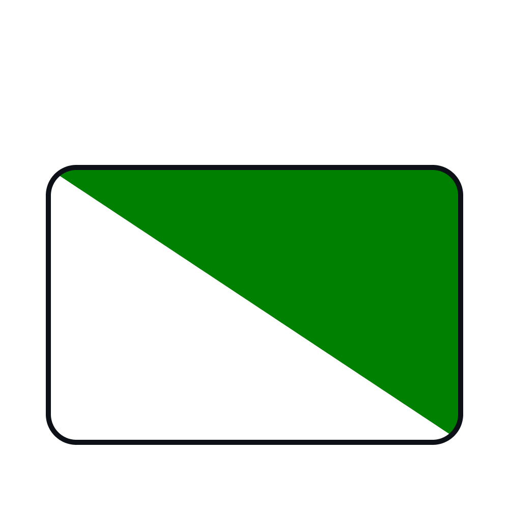
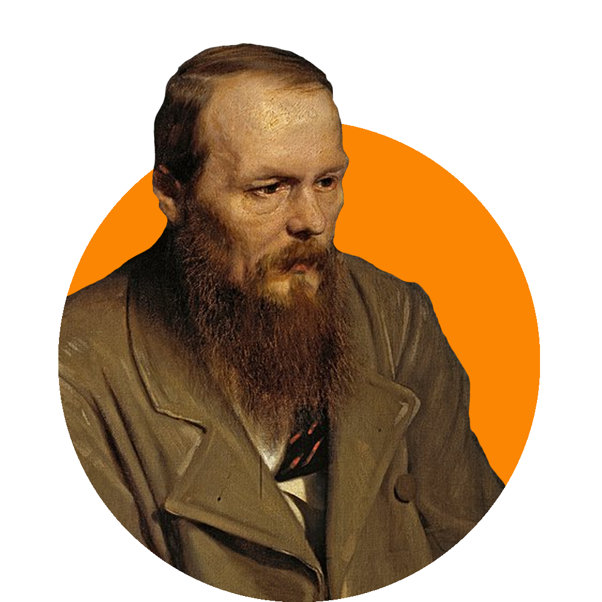

	
	
	

		<b>«Так просто быть умным. Я свой мозг оставил где-то на Думской»</b>
	

---
### :speech_balloon: About me:
Average  kid who is trying to learn how to write code
- :seedling: I'm currently trying to learn mobile development
- :speaking_head: I'm speaking English(B1) and Russian(Native)
- :zap: In free time really love to listen to music and podcasts about everything in the world

---
###  :hammer_and_wrench: Language and Tools

	
	
	
	
	

<!--
**gavilovskij/gavilovskij** is a ✨ _special_ ✨ repository because its `README.md` (this file) appears on your GitHub profile.

Here are some ideas to get you started:

- 🔭 I’m currently working on ...
- 🌱 I’m currently learning ...
- 👯 I’m looking to collaborate on ...
- 🤔 I’m looking for help with ...
- 💬 Ask me about ...
- 📫 How to reach me: ...
- 😄 Pronouns: ...
- ⚡ Fun fact: ...
-->
